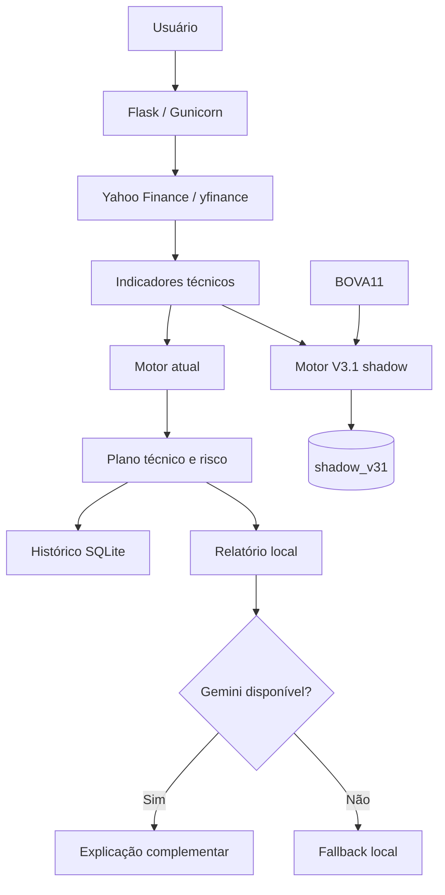

<div align="center">

# B3 AI Analyzer

**Análise técnica de ações e FIIs da B3 com motor quantitativo local, backtest, histórico e explicação complementar por IA.**


</div>

## Visão geral

O **B3 AI Analyzer** consulta dados diários de mercado, calcula indicadores técnicos, avalia contexto, tendência, momentum e risco e entrega uma leitura resumida em português.

A arquitetura separa duas responsabilidades:

- o **motor quantitativo local** calcula o sinal e os níveis técnicos;
- o **Google Gemini** apenas explica os dados e o sinal já definidos.

Se a IA estiver indisponível, a aplicação continua funcionando com relatório local. O projeto também mantém histórico em SQLite, backtest direcional e o Motor V3.1 em `shadow mode` para validação prospectiva sem alterar o sinal visível atual.

> Uso educacional e informativo. Não constitui recomendação de investimento.

## Principais recursos

- consulta de ações e FIIs da B3 com ou sem o sufixo `.SA`;
- coleta diária com `yfinance` e fallback quando o modo de reparo falha;
- EMA 9/21, SMA 50/200, RSI 14, MACD, ATR 14 e volatilidade;
- retorno de 20 e 60 pregões;
- suporte e resistência dos 20 pregões anteriores;
- volume relativo, CLV e amplitude da barra em ATR;
- detecção de rompimentos de 20 pregões;
- motor local com `COMPRA`, `VENDA` ou `NEUTRO`;
- plano técnico com referência, stop, alvo e relação risco-retorno;
- histórico persistente das análises;
- backtest pela interface e por CLI;
- explicação complementar por Gemini com fallback local;
- envio opcional para Telegram;
- Motor V3.1 em observação paralela com BOVA11 como contexto de mercado;
- suíte automatizada de testes e CI no GitHub Actions.

## Como funciona



## Estado dos motores

| Camada | Estado | Função |
|---|---|---|
| Motor atual | Produção | Gera o sinal visível `COMPRA`, `VENDA` ou `NEUTRO` |
| Motor V3.1 | Shadow mode | Calcula `COMPRA`, `AGUARDAR`, `EVITAR` ou `NEUTRO` sem alterar a resposta principal |
| Gemini | Complementar | Explica o resultado; não pode recalcular nem contradizer o motor |

### Motor V3.1

O V3.1 foi congelado após auditoria histórica ampliada e está sendo observado prospectivamente.

Na auditoria de 10 anos, o gatilho comprador de rompimento confirmado apresentou **300 eventos**. No horizonte de 20 pregões, foram observados **61,0% de acerto**, **profit factor bruto de 1,77** e **profit factor de 1,67 após custo hipotético total de 0,20% por operação**.

Esses números são históricos e não garantem comportamento futuro. O V3.1 ainda não substitui o motor visível.

Detalhes: [`docs/MOTOR_V31.md`](docs/MOTOR_V31.md).

## Plano de risco

O projeto evita transformar uma leitura direcional em uma falsa oportunidade.

Quando há nível estrutural válido, suporte ou resistência são preservados. O sistema não desloca um alvo apenas para forçar uma relação 2:1. A relação risco-retorno real é apresentada e o setup pode ser classificado como aprovado, atenção ou fraco.

Mais detalhes: [`docs/METHODOLOGY.md`](docs/METHODOLOGY.md).

## Backtest

A tela `/backtest` avalia historicamente o motor sem usar informações futuras na formação do sinal.

Metodologia padrão:

- `warmup`: 220 pregões;
- sinal calculado no fechamento do pregão `t`;
- entrada de referência na abertura de `t+1`;
- saída no fechamento após horizonte definido;
- registro de evento quando o estado do sinal muda;
- métricas de acerto, retorno médio/mediano e profit factor.

Também é possível executar:

```bash
python scripts/backtest.py PETR4
python scripts/backtest.py VALE3 --period 10y --horizon 20
python scripts/backtest.py ITUB4 --json
```

O backtest é um diagnóstico direcional. Não representa rentabilidade líquida de uma estratégia completa.

## Estrutura do projeto

```text
b3-ai-analyzer/
├── main.py
├── wsgi.py
├── prompt_analise.txt
├── services/
│   ├── backtest_service.py
│   ├── cache_service.py
│   ├── gemini_service.py
│   ├── history_service.py
│   ├── indicators_service.py
│   ├── market_service.py
│   ├── report_service.py
│   ├── shadow_v31_service.py
│   ├── signal_service.py
│   └── telegram_service.py
├── scripts/
│   ├── backtest.py
│   ├── check.sh
│   └── shadow_v31_status.py
├── templates/
├── static/
├── tests/
├── docs/
│   ├── ARCHITECTURE.md
│   ├── METHODOLOGY.md
│   ├── MOTOR_V31.md
│   └── PRODUCTION.md
└── .github/
    └── workflows/
        └── ci.yml
```

## Instalação

Requer Python 3.10 ou superior. O ambiente de produção atual utiliza Python 3.12.

```bash
git clone git@github.com:EduMiranda78/b3-ai-analyzer.git
cd b3-ai-analyzer
python3 -m venv .venv
source .venv/bin/activate
python -m pip install --upgrade pip
pip install -r requirements.txt
cp .env.example .env
```

Para desenvolvimento:

```bash
pip install -r requirements-dev.txt
python -m pytest
```

## Configuração

Exemplo mínimo:

```env
GOOGLE_API_KEY=
GEMINI_MODEL=gemini-3.6-flash
TELEGRAM_BOT_TOKEN=
TELEGRAM_CHAT_ID=
SHADOW_V31_ENABLED=1
```

A chave do Gemini é opcional para o motor técnico. Nunca publique `.env`, chaves de API, tokens, bancos SQLite reais, backups ou logs de produção.

## Execução

Desenvolvimento:

```bash
python main.py
```

Gunicorn:

```bash
gunicorn --bind 0.0.0.0:5000 wsgi:app
```

A documentação de produção está em [`docs/PRODUCTION.md`](docs/PRODUCTION.md).

## Testes e qualidade

```bash
python -m pytest
bash scripts/check.sh
```

O workflow de CI executa compilação de sintaxe e testes automaticamente em pushes e pull requests para `main`.

## Segurança e limitações

- `yfinance` depende da disponibilidade e qualidade dos dados do Yahoo Finance;
- o sistema usa principalmente dados diários e não modela microestrutura intraday;
- backtests podem sofrer vieses de seleção, sobrevivência e regime;
- força técnica não é probabilidade calibrada de acerto;
- relação risco-retorno não substitui dimensionamento de posição;
- resultados passados não garantem resultados futuros;
- a IA não participa da decisão quantitativa.

Consulte [`SECURITY.md`](SECURITY.md) antes de expor ou modificar a aplicação.

## Roadmap

- [x] motor técnico local e histórico SQLite;
- [x] backtest direcional;
- [x] relatório simplificado para leitor não técnico;
- [x] Motor V3.1 em shadow mode;
- [x] validação automatizada no GitHub Actions;
- [ ] consolidar amostra prospectiva do V3.1;
- [ ] motor de risco estrutural independente;
- [ ] comparação formal motor atual x V3.1;
- [ ] métricas por regime, setor e liquidez;
- [ ] camada fundamentalista separada e auditável;
- [ ] autenticação e rate limiting antes de exposição pública ampla.

## Documentação

- [Arquitetura](docs/ARCHITECTURE.md)
- [Produção](docs/PRODUCTION.md)
- [Motor V3.1](docs/MOTOR_V31.md)
- [Metodologia e risco](docs/METHODOLOGY.md)
- [Segurança](SECURITY.md)
- [Contribuição](CONTRIBUTING.md)
- [Histórico de mudanças](CHANGELOG.md)

## Autor

Desenvolvido e mantido por **Eduardo Miranda**.

GitHub: [`EduMiranda78`](https://github.com/EduMiranda78)

## Licença

Distribuído sob a licença [MIT](LICENSE).
