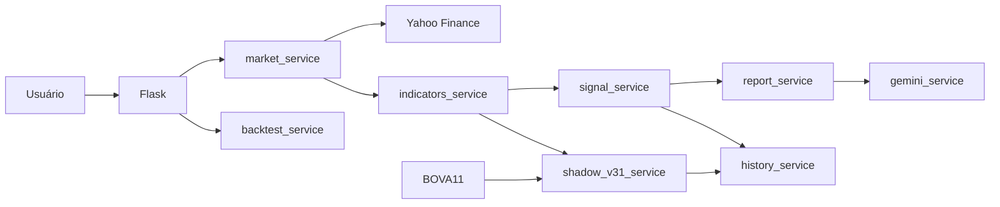

# Arquitetura

## Visão geral

O B3 AI Analyzer separa aquisição de dados, cálculo quantitativo, persistência e explicação textual. A camada de IA não decide o sinal.

## Componentes

### `main.py`

Responsável por:

- rotas Flask;
- validação de entrada;
- orquestração da análise;
- renderização dos templates;
- acionamento do histórico, Gemini e shadow mode.

### `services/market_service.py`

- normaliza tickers da B3;
- consulta `yfinance`;
- usa cache local;
- tenta modo de reparo quando possível;
- repete a coleta sem reparo quando necessário;
- saneia colunas, datas e preços antes de entregar o histórico.

### `services/indicators_service.py`

Calcula os indicadores usados pelo motor, incluindo EMA, SMA, RSI, MACD, ATR, volatilidade, retornos, suporte/resistência, volume relativo, CLV e rompimentos.

### `services/signal_service.py`

Motor visível atual. Consolida os fatores técnicos, produz `COMPRA`, `VENDA` ou `NEUTRO` e monta o plano de risco.

### `services/shadow_v31_service.py`

Motor V3.1 em observação paralela. Usa BOVA11 como contexto de mercado e não altera a saída principal. Os estados internos são `COMPRA`, `AGUARDAR`, `EVITAR` e `NEUTRO`.

### `services/history_service.py`

Persistência SQLite. O banco padrão fica em `instance/analisador.db`, ou no caminho definido por `ANALISADOR_DB_PATH`.

Tabelas relevantes:

- `analyses`: histórico das análises visíveis;
- `shadow_v31`: leituras prospectivas do Motor V3.1;
- `shadow_v31_outcomes`: espaço preparado para resultados prospectivos futuros.

### `services/gemini_service.py`

Camada opcional de explicação textual. Recebe o contexto já calculado e não pode recalcular ou contradizer o sinal local.

### `services/backtest_service.py`

Executa avaliação histórica direcional com dados disponíveis até cada data de sinal.

## Fluxo de uma análise

1. usuário informa o ticker;
2. ticker é normalizado para o padrão Yahoo Finance;
3. histórico é baixado e saneado;
4. indicadores são calculados;
5. motor atual produz sinal e plano técnico;
6. resultado é persistido;
7. relatório local é construído;
8. Gemini pode complementar a explicação;
9. V3.1 é executado de forma isolada e gravado no shadow mode;
10. a resposta HTML é entregue ao usuário.

Falhas no Motor V3.1 ou no Gemini não devem derrubar o fluxo principal.

## Princípios de projeto

- decisão quantitativa separada de texto gerado por IA;
- nenhuma afirmação probabilística sem calibração;
- suporte e resistência calculados sem usar a própria barra atual;
- backtest sem lookahead na formação do sinal;
- banco e segredos fora do repositório;
- mudanças de motor só devem ser promovidas após validação histórica e prospectiva.

## Interface

Templates principais:

- `index.html`: entrada do ticker;
- `relatorio.html`: resumo e níveis técnicos;
- `historico.html`: histórico de análises;
- `historico_detalhe.html`: detalhe persistido;
- `backtest.html`: avaliação histórica.

A folha principal de estilos fica em `static/css/style.css`.
